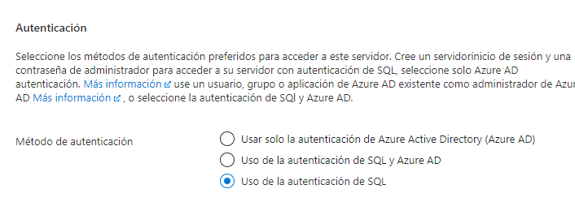
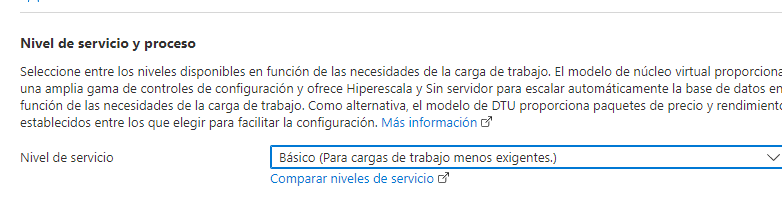

## Autores: Stefania Giraldo

1. primero es entrar en la cuenta de **Microsoft Azure** 

2. vamos a grupos de recurso y creamos un llamado partsunlimited

3. Creamos un nuevo servidor donde creamos el administrador y su respectiva contraseña con los estandares de 
seguridad

4. cambiar el nivel de servicio a  **Básico**

5. en  **App services** creamos una aplicación web y en grupo de recursos **partsunlimited**

6. Agregamos los detalles de la instancia y en la pila del entorno en tiempo de ejecución

7. Creamos un nuevo plan de servicio y modificamos su tamaño a **S1** 

# perdon lo poquito

