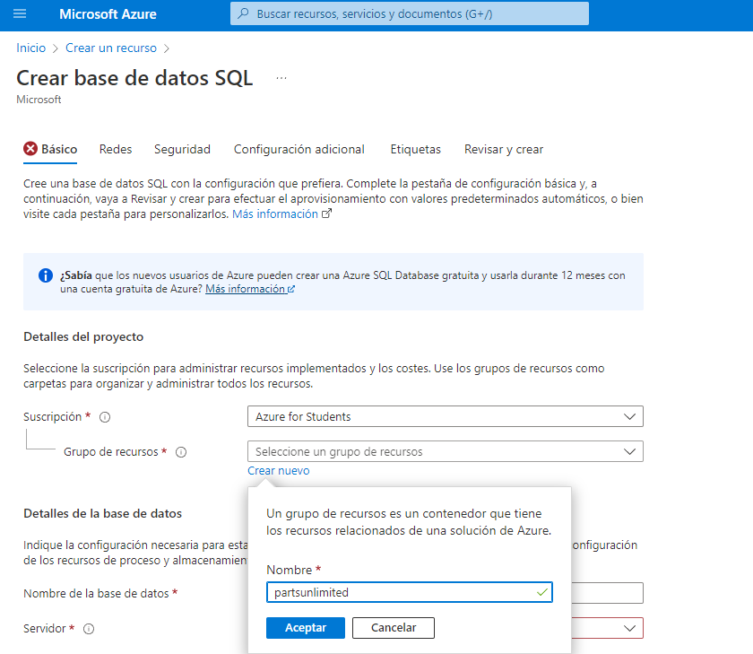
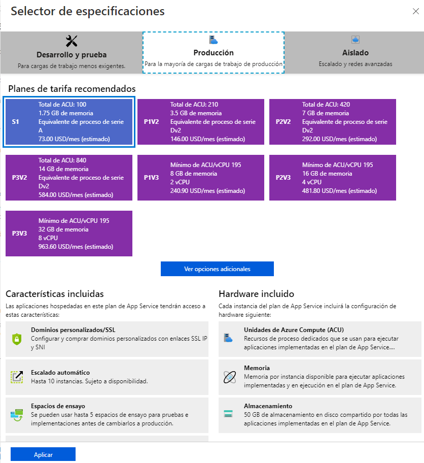

# Laboratorio-6
Azure DevOps

## Autores: David Narváez - Cristian Rodríguez

### Solución:

1. Lo primero es logearse en la cuenta de **Microsoft Azure**, posteriormente crear de recurso una base de datos SQL 

2. a continuación vamos a grupos de recurso donde creamos uno nuevo llamado **partsunlimited**

3. Creamos un nuevo servidor en el cual ponemos nuestros apellidos como nombres y cambiamos el método de autenticación
a **Uso de la autenticación de SQL** donde creamos el administrador y su respectiva contraseña con los estandares de 
seguridad

4. En esta parte nos centramos en cambiar el nivel de servicio que vamos a emplear **Básico**

5. Mientras se crea, nos vamos al apartado de **App services** donde creamos una aplicación web y en grupo de recursos
seleccionamos el mismo de la base de datos **partsunlimited**

6. Agregamos los detalles de la instancia y en la pila del entorno en tiempo de ejecución seleccionamos **ASP.NET V4.8**

7. Creamos un nuevo plan de servicio y modificamos su tamaño a **S1** en la sección de **producción**, aplicamos los cambios y creamos

8. Nuevamente hacemos el mismo proceso pero en el nombre agregamos **-prod** y lo creamos.

9. 

